Antes de empezar...

Descarga:

 [Guía para la presentación de trabajos académicos escritos](http://deustokom-lab.deusto.es/gida-guia/GuiaPresentacionTrabajos.pdf)  
 [Archivo plantilla](http://deustokom-lab.deusto.es/gida-guia/txantiloia-plantilla.dotx)

[http://deustokom-lab.deusto.es/gida-guia/](http://deustokom-lab.deusto.es/gida-guia/)

---

Antes de empezar...

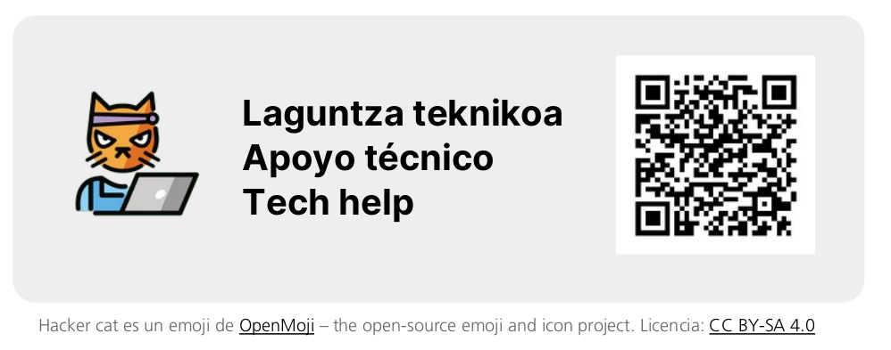

# Formato del documento {data-background-color="var(--main-color)"}

---

{height="600" style="border:solid 1px var(--dark-gray4);"}

:::notes
Márgenes de al menos 2,5cm en los cuatro bordes

Portada:
- Logotipo
- (Nombre de la asignatura)
- Título del trabajo
- Autoría y fecha
:::

---

:::notes
Tamaño para el cuerpo de texto entre 10 y 12 puntos.

Títulos, misma fuente en negrita o combinarse con tipografía de otro estilo. Evitar variar tipografías en exceso; en documentos académicos, 1-2.

Interlineado 1,5, mínimo 1,2.
:::

---

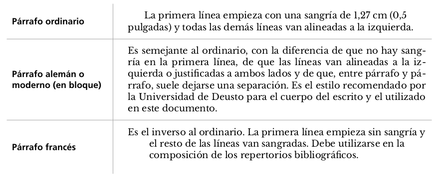

:::notes
Justificado debe combinarse siempre con división de palabras.
:::

---

:::notes
Numerados, alineados en el margen izquierdo sin sangría.

Conviene no numerar más de tres niveles.

Cada título de primer nivel debería empezar en una página nueva.
:::

---

:::notes
El número de página debe incluirse obligatoriamente en el pie de página del documento.

En documentos de cierta extensión, debe incluirse además un índice inmediatamente después de la portada. Todos los títulos de sección y subsección, utilizando la misma numeración que en el texto, y señalando el número de página.
:::

---

- puede abrirse desde cualquier equipo o dispositivo
- preserva la puesta en página
- búsqueda y selección de texto, enlaces clicables

:::notes
Siempre se deben priorizar las indicaciones y requerimientos específicas de cada enunciado.
:::

# Gestión digital de archivos {data-background-color="var(--main-color)"}

---

- Texto enriquecido = texto + metadatos (formato y puesta en página)
- Se crean y modifican usando **procesadores de textos**
- Los formatos no son intercompatibles

## {data-background-image="img/messy-desk.jpg"}

:::notes
Es importante generar y mantener una estructura lógica y ordenada para el almacenamiento de archivos digitales.

Recomendable generalmente que cada trabajo esté en su propia carpeta, que contenga el trabajo en sí junto con todos los archivos relacionados (imágenes, documentos de referencia, enunciados...). 

A su vez, esta carpeta debería estar dentro de una carpeta correspondiente a la asignatura, por ejemplo, que tendrá otras carpetas para los apuntes, materiales...

En general es una buena práctica que todo el material proveniente o generado durante tus estudios esté dentro de una única carpeta, con sus correspondientes subcarpetas y sub-subcarpetas según tu sistema preferido de organización.

Nombres de archivos: consistentes y descriptivos de contenido para permitir localizarlos rápidamente. Caracteres alfanuméricos, guiones (no espacios, tildes o eñes).

VERSIONES
:::

---

:::notes
- Nombre descriptivo del trabajo, mantener para todas las copias
- Fecha de inicio de versión, formato se ordena alfabéticamente = cronológicamente
- Descripción de la versión

Realizar una nueva versión cada vez que se vayan a realizar cambios importantes: primer borrador de texto completo, cambiar la estructura del documento, o falte solo revisión final + **copia de la versión exacta enviada para evaluación**.
:::

---

## {data-background-image="img/words.jpg"}

Nunca  
usar  
doble

, , 

:::notes
Tipo de aplicación más utilizado para generar trabajos académicos: LibreOffice writer, Microsoft Word, apple Pages o Google Docs.

Además de ayudar a establecer elementos de formato y estilos, los procesadores de textos permiten automatizar (y evitar errores humanos):

- encabezados y pies de página + número de página
- notas al pie, notas al final
- índices
- revisión ortográfica y (en parte) gramática

Los estilos de los procesadores de textos y los documentos formateados como plantillas permiten automatizar el establecimiento de las especificaciones de formato y aplicarlas fácilmente, además de evitar errores humanos y garantizar la coherencia formal a lo largo del documento. 

EVITAR introducción de espaciados de forma manual
:::

---

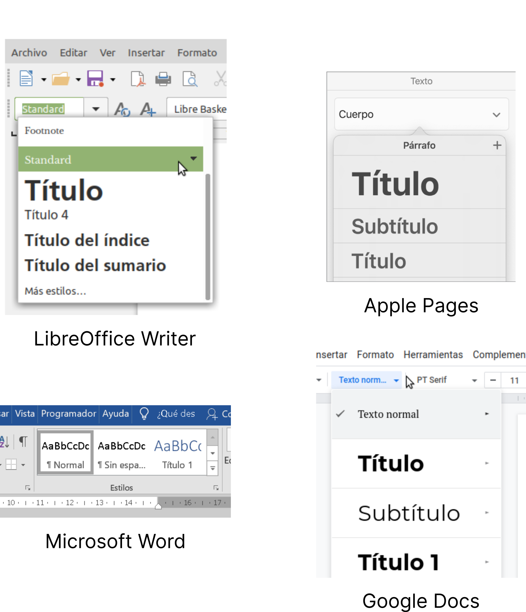{height="550"}

:::notes
Las hojas de estilos son configuraciones que establecen los formatos del texto y las páginas de un documento en un procesador de textos. El concepto "hojas de estilo" se utiliza también en los ámbitos de la autoedición o el diseño web.

- Fuente y estilo (negrita, cursiva), color, tamaño
- Alineación
- Sangrías y espaciado: lateral (izda. y dcha.), espaciado primera línea, vertical (antes y después del texto = espaciado entre párrafos), interlineado
- Flujo de texto: división de palabras, saltos de página o de sección
- Otros: espaciado entre letras, tabulaciones, letras capitulares, bordes o numeración
:::

---

Siempre que una configuración de formato pueda hacerse a través de una definición de estilo, es así como debería hacerse, en vez de aplicarse manualmente.

:::notes
El uso consistente de las hojas de estilo permite otras automatizaciones como realizar modificaciones de estilo fácilmente, o generar índices o tablas de contenidos = una lista de todos los fragmentos de texto marcados con estilos de título + las páginas en las que se encuentran.

Las PLANTILLAS son un tipo específico de documento que ya trae todas las especificaciones de estilo definidas. Al abrir, se genera un nuevo documento con los estilos establecidos en el archivo plantilla. EJEMPLO.
:::

# Cómo citar correctamente {data-background-color="var(--main-color)"}

## {data-background-image="img/source.jpg"}

:::notes
Citar y referir son las dos caras de una misma moneda. Siempre debe citarse la fuente de palabras o ideas de terceros, y todas las referencias completas de las citas empleadas en el documento deben incluirse al final.

Existen diferentes estilos MLA, IEEE, Norma UNE-ISO 690:2013. En el área de las Ciencias Sociales y Humanas, los estilos más habituales son Chicago y APA.
:::

---

- Autoría: ¿quién ha producido el documento citado?
- Fecha: ¿cuándo se publicó?
- Título: ¿cómo se titula?
- Fuente: ¿dónde se publicó?

---

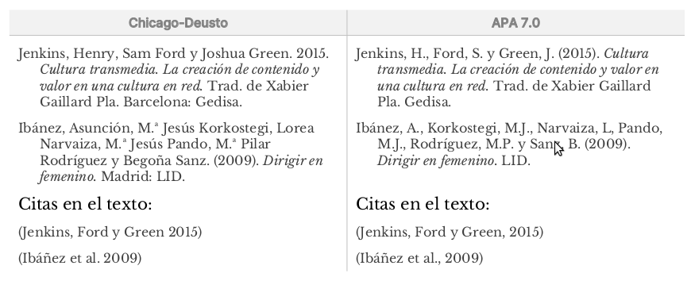

:::notes
Persona o grupo de personas responsable de la obra: uno o varios individuos, una institución u otro tipo de organismo, o una combinación.

Más de uno, se presentan siempre en el mismo orden en el que aparecen en la obra. 
:::

---

>- **Fecha** Generalmente, solo el año
>- **Título** 
>- **Fuente** Dónde puede recuperarse el documento citado

:::notes
En un libro, película... el editor. En obras que forman parte de algo, como capítulo de libro o artículo de revista, la fuente es ese algo que lo contiene, es decir, el libro o la revista.

Chicago-Deusto incluye ubicación geográfica para la mayoría de obras; APA no.

El formato es muy variable, según el tipo de documento.

Debe incluirse un URL o DOI siempre que sea posible.
:::

## {data-background-image="img/cables.jpg" class="left"}

`10.1145/1067268.1067287`

`https://doi.org/10.1145/1067268.1067287`

:::notes
Un URL es un identificador que representa la localización de un archivo digital en la web. Los navegadores web (Mozilla Firefox, Safari o Google Chrome, entre otros) utilizan URLs para recuperar páginas web.

Un DOI es un identificador único persistente (identifica de manera única al documento y no cambia a lo largo del tiempo) para documentos generalmente del ámbito académico, profesional o institucional. 

Los asigna una organización autorizada, sigue un formato estándar regulado. 

Entidad que registra el identificador / objeto o archivo en cuestión.
:::

---

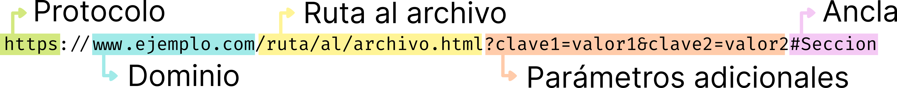

:::notes
Protocolo. La primera parte del URL indica qué protocolo debe usarse para el intercambio o transferencia de archivos. En el caso de sitios web, el protocolo es http o su versión más segura, https.

Nombre de dominio. Indica qué servidor web se está solicitando.

Ruta al archivo. Es la ruta de acceso al archivo en el servidor web. Originalmente, esta ruta representaba la ubicación física del fichero en el servidor web (en el ejemplo, el archivo archivo.html, en la carpeta al, a su vez dentro de la carpeta ruta), pero hoy día es una abstracción que el servidor interpreta para obtener el documento y que generalmente no se corresponde con una realidad física de archivos y carpetas.

Parámetros adicionales. Los URLs también pueden proporcionar parámetros adicionales al servidor web, en forma de lista de pares clave/valor, que se utilizan para realizar tareas adicionales antes de devolver el documento al navegador. Algunos de estos parámetros o variables de URL son necesarios para identificar el recurso, es decir, para poder acceder al recurso web específico en cuestión, pero otros ofrecen información adicional, como elementos para el seguimiento o perfilado del usuario, de la que puede prescindirse.

Ancla. Opcionalmente, un URL puede hacer referencia a una parte específica del documento al que se accede. Si se omite esta parte del URL, se accederá a la parte superior del documento.
:::

##

#### Buenas prácticas en el empleo de DOIs y URLs

>- Incluye un DOI siempre que exista.
>- Presenta tanto DOIs como URLs en formato URL (DOIs precedidos de `https://doi.org/`).
>- Formato consistente (con o sin subrayado), enlaces funcionales
>- Utiliza siempre el URL directo a un documento. Un URL de un resultado de búsqueda no es válido.
>- Elimina los parámetros de seguimeinto del URL
>- Copia y pega de la barra de direcciones para evitar errores. Comprueba siempre que devuelve el documento que pretendes referenciar. 

## {data-background-image="img/books.jpg"}

:::notes
La lista de referencias:

- se sitúa al final de la obra;
- contiene todas las referencias completas mencionadas en el documento;
- se ordena alfabéticamente por apellido de autor;
- sangría francesa, sin espacio entre referencias.
:::

---

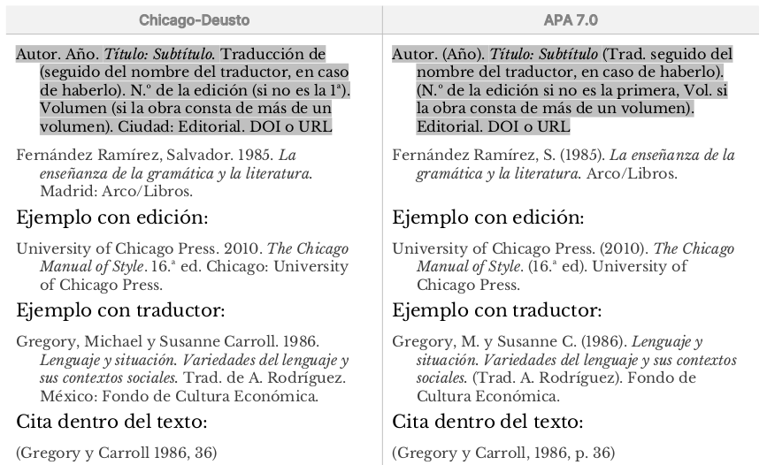

---

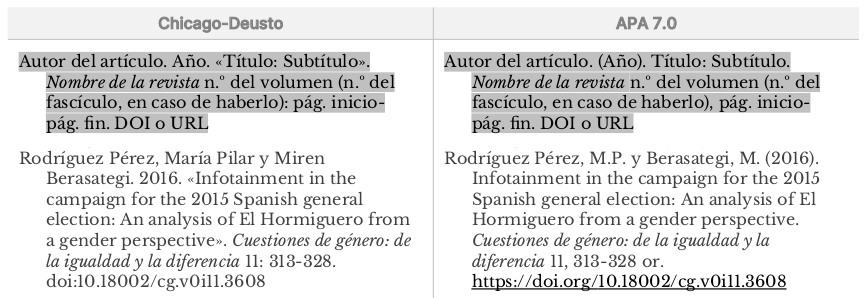

---

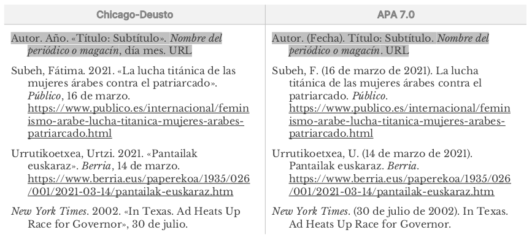

---

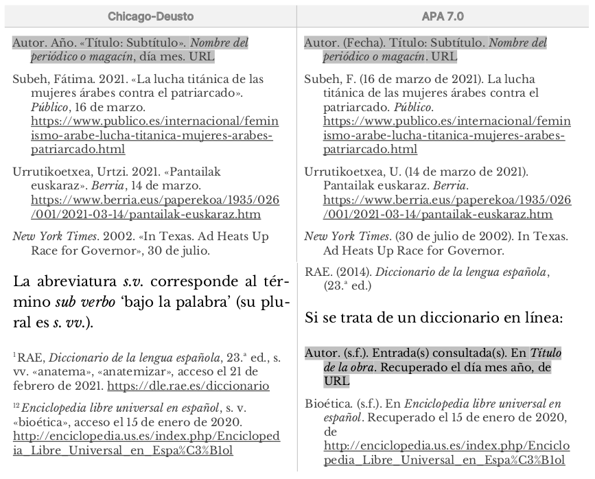{height="600"}

---

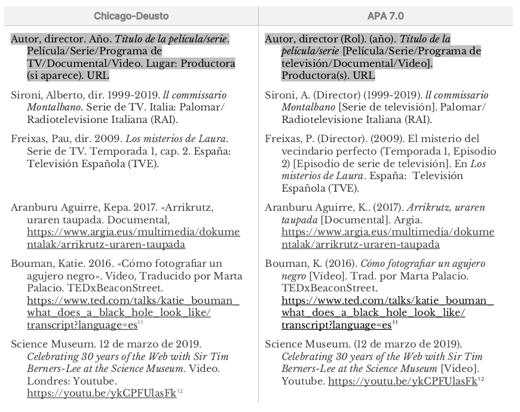{height="600"}

# Gestor bibliográfico {data-background-color="var(--main-color)"}

---

{width="400"}

:::notes
- Importar referencias bibliográficas de diferentes fuentes: bbdd en línea, catálogos de blibiotecas, archivos de texto
- Crear, diseñar y rediseñar bibliografías en diferentes formatos y estilos
- Insertar citas y referencias en un documento de texto
- Compartir bibliografías con otras personas
:::

---

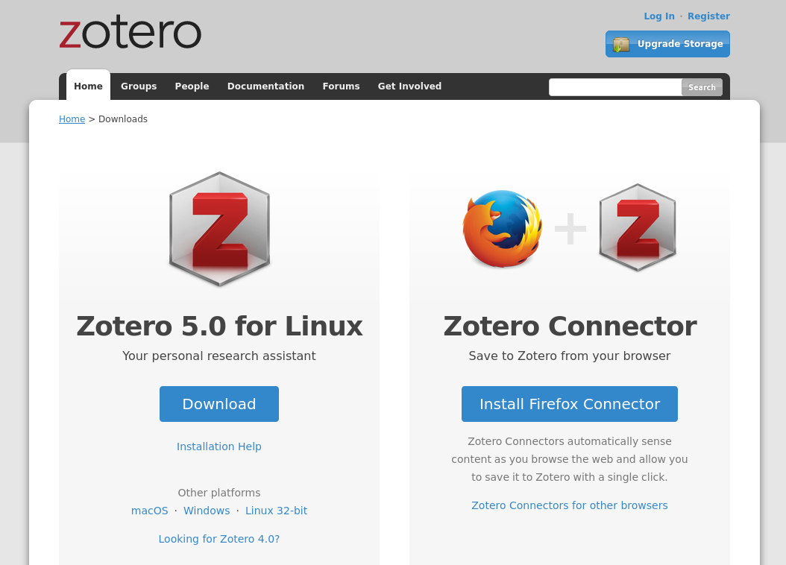{width="800"}

:::notes
Altamente recomendable empezar a utilizar un gestor bibliográfico cuanto antes y **usarlo de manera sistemática**. Añade tus refererencias a Zotero y completa toda la información que sea posible (como mínimo, la necesaria para la referencia completa para poder citarla después en un trabajo) desde el principio. 

- Puede instalarse de manera gratuita en cualquier sistema operativo, dispone de conectores para los procesadores de textos más populares y, al ser de código abierto, existen extensiones desarrolladas por la comunidad que ofrecen funcionalidades añadidas
- Permite añadir referencias manualmente, a través de identificadores (como ISBN o DOI) o directamente desde el navegador web 
- Puedes agrupar tus referencias bibliográficas (por ejemplo, por asignatura o por tema)
- Tus referencias se pueden sincronizar en la nube de Zotero para que puedas acceder a ellas desde cualquier dispositivo
- Permite exportar referencias individuales completas o a modo de cita en el texto, y también exportar agrupaciones de referencias como bibliografías, en cualquier estilo de citas
- Puedes generar colecciones compartidas con otras personas
- Mediante el uso de extensiones (también gratuitas), permite gestionar archivos adjuntos a las referencias (el artículo en PDF, por ejemplo), anotaciones
:::

---

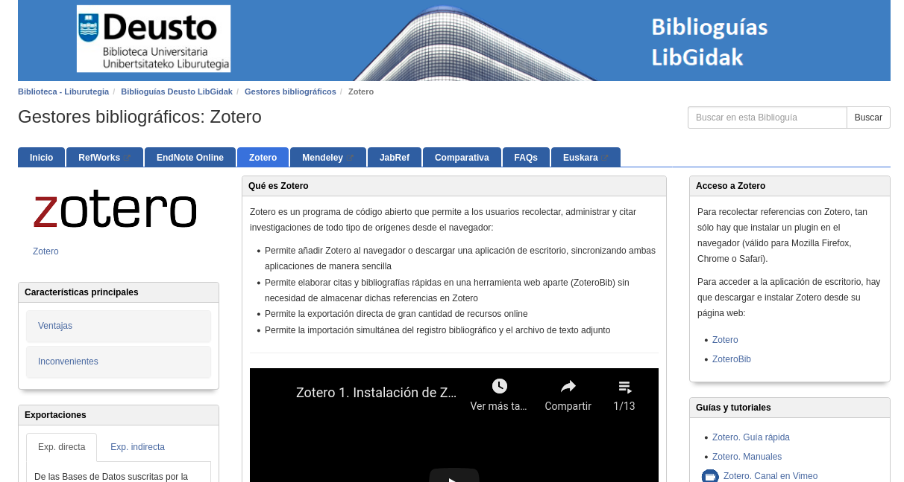{width="800"}

---

¡Gracias!

{width="400"}

<!-- 
https://biblioguias.biblioteca.deusto.es/Gestoresbibliograficos/zotero
https://biblioguias.cepal.org/zotero
-->
